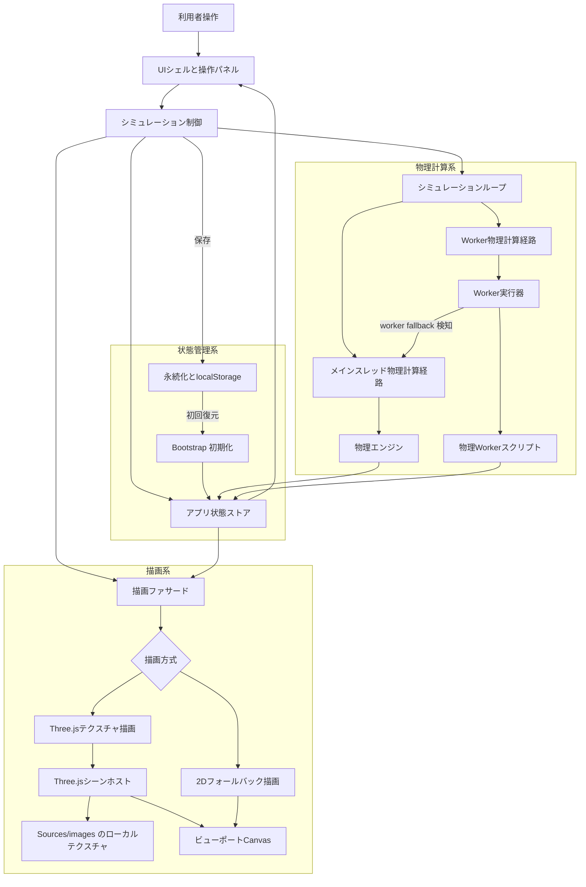

# Shos.NBodyProblemSimulator

[English README](README.md)


[](https://www2.shos.info/shosnbody/)

HTML5、CSS3、Vanilla JavaScript、Three.js で構築された、ブラウザ専用の 3 次元 N 体問題シミュレーターです。

## 公開サンプル

- [https://www2.shos.info/shosnbody/](https://www2.shos.info/shosnbody/)
- 公開サンプルは、現在のシミュレーターをブラウザ上で配信したものです。ローカルセットアップなしで、現行 UI、描画モード、再生操作の流れを確認できます。

### 実行イメージ


## アーキテクチャ

実行時は、物理計算、描画、UI 更新、永続化を分離し、メインスレッド経路と Worker 経路が同じアプリケーション状態の流れを共有する構成にしています。



永続化への書き込みは store からの自動保存ではなく、controller 境界を通して行われます。初回復元は bootstrap が担当し、定常時の store 更新経路に入る前に状態へ反映されます。

## 動作概要

- 現在の既定実行経路は、Velocity Verlet を既定の積分法とするメインスレッド実行です。
- 現在の実装では、RK4 比較、Worker 実行経路、シミュレーション処理時間の検証も利用できます。
- 検証時は `?execution=main` または `?execution=worker` を使うことで、永続化されない実行方式の上書きができます。
- Three.js は Sources/vendor 配下のローカル配布ファイルから読み込みます。
- body 用テクスチャは Body.name を正規化した値に基づいて Sources/images から読み込まれます。
- Three.js の初期化に失敗した場合でも、アプリは 2D フォールバックモードで継続利用でき、ステータスメッセージにテクスチャ付き body が使えない理由を表示します。
- 既定の初期状態は Count 8 で、Sources/data/default-bodies.js に同梱された body データセットを使います。Data/nbodies.csv は実行時には読み込みません。
- Target option の `System Center` は全 body の質量中心を追跡し、total mass が 0 の場合のみ average position にフォールバックします。
- 現在の既定 preset 一覧は `binary-orbit`、`sample`、`random-cluster` です。
- `sample` preset は Sources/data/default-bodies.js の固定データセットを適用します。
- `random-cluster` はより広い生成範囲を使います。mass は `0.05` から `120.00`、radius は `6.00`、minimum body distance は `0.80`、tangent speed は `0.30` から `1.40`、per-axis velocity jitter は最大 `0.25` です。

## 永続化方針

- localStorage は固定キー `nbody-simulator.state` を使用します。
- 永続化フィールド方針は、永続化対象フィールドと非永続化フィールドを実装、仕様書、計画書の間で整合させます。

永続化対象フィールド:

- `appVersion`
- `bodyCount`
- `bodies`
- `simulationConfig.gravitationalConstant`
- `simulationConfig.timeStep`
- `simulationConfig.softening`
- `simulationConfig.integrator`
- `simulationConfig.maxTrailPoints`
- `simulationConfig.presetId`
- `simulationConfig.seed`
- `uiState.selectedBodyId`
- `uiState.cameraTarget`
- `uiState.showTrails`
- `uiState.expandedBodyPanels`
- `committedInitialState`
- `playbackRestorePolicy`

非永続化フィールド:

- `runtime.lifecycleMetadata`
- `runtime.lifecycleNotice`
- `runtime.statusMessage`
- `runtime.executionNotice`
- `runtime.validationErrors`
- `runtime.fieldErrors`
- `runtime.fieldDrafts`
- `runtime.metrics`
- `runtime.simulationTime`
- 軌跡履歴の点配列
- worker accumulators や pending requests などの中間計算状態

- `runtime.lifecycleMetadata` と `runtime.lifecycleNotice` は観測用の実行時値であり、各起動時に再注入されます。
- `playbackState = running` と `playbackState = paused` は永続化されません。reload 時は常に `playbackRestorePolicy = restore-as-idle` を通じて `idle` に正規化されます。

## UI

- header には app title、playback state、runtime status message を表示します。
- header はコンパクトに保ち、viewport が縦方向の大部分を確保できるようにしています。
- header の補助説明文は small と medium layout では隠され、wide desktop layout のみ再表示されます。
- controls panel は全 breakpoint で header の直下に配置され、large layout では body editor と viewport row の上にあるコンパクトな full-width strip になります。
- controls panel は Count、dt、Soft、Target、Trail のような compact visible labels を使い、正式名称は title または aria-label に保持します。
- UI に表示する実数値は原則として小数第 2 位までに丸めます。ただし Time Step と Softening の control input は小数第 3 位まで保持します。
- Seed field は `random-cluster` のとき blank なら `auto on Gen` を表示し、次の Generate で自動 seed が割り当てられることを示します。
- playback buttons は Gen、Run、Hold、Go、Reset のような compact visible text を使います。
- Validation はエラーがないときは非表示で、invalid input がある場合だけ強調表示します。
- Body settings は各 body card ごとに Open または Closed toggle を持ち、複数の body editor を同時に開いたままにできます。
- visualization stage は、非インタラクティブな UI よりも canvas 領域を優先するため、意図的に高さを大きめにしています。
- visualization height は mobile、tablet、desktop、wide desktop の各 breakpoint に応じて段階的に変化します。
- simulation metrics panel は viewport-stage の直下に配置し、runtime metrics が canvas に重ならないようにします。
- simulation metrics panel は desktop と wide desktop でも低い高さを維持するため、inline レイアウトと長い値の省略表示を使います。

## Controls 詳細

### COUNT

- 正式名称: `Body Count`
- 表示テキスト: `Count`
- 意味: 現在のシミュレーションで設定する body 数を指定します。
- 範囲: 通常の UI 範囲は 2 から 10 です。
- preset との関係: `Binary` は常に 2、`Sample` は常に 8、`Random` は 3 から 10 に正規化されます。
- 再現性との関係: `Random` では body count も preset と seed と並ぶ再現キーの一部です。

### PRESET

- 正式名称: `Preset`
- 表示テキスト: `Preset`
- 意味: Generate が使う初期条件テンプレートを選びます。
- `Binary`: 近似円軌道を意図した 2 体設定です。seed は使いません。
- `Sample`: `Sources/data/default-bodies.js` に含まれる固定の 8 体データセットを読み込みます。seed は使いません。
- `Random`: 現在の body count を使って seeded random cluster を生成します。最初の body は重く、残りは軽い companion bodies として生成されます。

### SEED

- 正式名称: `Seed`
- 表示テキスト: `Seed`
- 意味: `Random` preset の再現性を制御します。
- 範囲: 0 から 4294967295 までの 32-bit unsigned integer です。
- 空欄時の動作: `Random` 選択中に空欄のままなら `auto on Gen` と解釈され、次の Generate で新しい seed が自動採番されます。
- preset との関係: `Binary` と `Sample` では seed は使われず、固定 preset データとして扱われます。

### DT

- 正式名称: `Time Step`
- 表示テキスト: `dt`
- 意味: 数値積分 1 ステップで進める固定シミュレーション時間です。
- 制約: 0 より大きい値でなければなりません。
- 既定値: `0.005`
- 実務上の意味: 値を小さくすると安定性や energy behavior は改善しやすい一方で、計算量は増えます。値を大きくすると計算は軽くなりますが、接近時の安定性は下がりやすくなります。
- 表示ルール: control input では既定値が見えるように小数第 3 位まで表示します。

### SOFT

- 正式名称: `Softening`
- 表示テキスト: `Soft`
- 意味: 近接時の特異的な加速度発散を和らげる重力軟化係数です。
- 制約: 0 以上でなければなりません。
- 既定表示値: `0.010`。内部既定値は `0.01` です。
- 実務上の意味: 値を大きくすると近距離相互作用はより滑らかになります。値を小さくすると逆二乗則に近づきますが、接近時の数値負荷は厳しくなります。
- 表示ルール: control input では小数第 3 位まで表示します。

### INT

- 正式名称: `Integrator`
- 表示テキスト: `Int`
- 意味: body 更新に使う数値積分法を選びます。
- `Verlet`: Velocity Verlet の略です。既定積分法で、長時間の軌道計算に対してコストと安定性のバランスが良いため既定になっています。
- `RK4`: 4 次の Runge-Kutta 法です。比較用として有用で、局所精度は高いことが多いですが、symplectic ではありません。

### TARGET

- 正式名称: `Camera Target`
- 表示テキスト: `Target`
- 意味: viewport で camera が追跡する対象を選びます。
- `System Center`: 全 body の質量重み付き重心を追跡します。total mass が 0 の場合は全 body の average position にフォールバックします。
- 各 body: 各 body は `Body Name (body-id)` 形式で候補に現れ、個別 body を追跡できます。

### TRAIL

- 正式名称: `Trails`
- 表示テキスト: `Trail`
- 意味: 軌道履歴の描画を on/off します。
- 既定値: on
- 作用範囲: 物理計算自体ではなく、可視化だけを切り替えます。
- Reset との関係: Generate と Reset は既存の trail 履歴を消去します。
- 保持上限: 現在の trail buffer は body ごとに最大 300 点を保持し、超過した古い点から捨てます。

## ローカルセットアップ

1. `npm install` を実行します。
2. `npm run vendor:three` を実行します。
3. Sources を HTTP 経由で配信します。
4. ローカルサーバー経由で Sources/index.html を開きます。

## Minified バンドル生成

- `npm run build:min` を実行すると、worker を維持した最小化済み runtime を生成します。
- 生成物は [Dist/index.html](Dist/index.html)、[Dist/main.min.js](Dist/main.min.js)、[Dist/physics-worker.min.js](Dist/physics-worker.min.js)、[Dist/style.css](Dist/style.css)、[Dist/images](Dist/images) です。
- source entry files を変更せず、配布専用 directory として bundle 済み runtime を使いたい場合は [Dist/index.html](Dist/index.html) を利用します。
- `npm run build:min:clean` を実行すると、生成済みの Dist 出力と、以前 Sources 配下に出力していた旧最小化ファイルを削除します。

### Dist の再生成

1. Sources 配下の source files や Dist にコピーされる assets を更新します。
2. `npm run build:min` を再実行します。
3. 再生成された [Dist/index.html](Dist/index.html)、[Dist/main.min.js](Dist/main.min.js)、[Dist/physics-worker.min.js](Dist/physics-worker.min.js)、[Dist/style.css](Dist/style.css)、[Dist/images](Dist/images) を利用します。
4. 先に前回の生成物を消したい場合は、`npm run build:min:clean` を実行してから `npm run build:min` を再実行します。

### Dist の配信

1. `npm run build:min` を実行します。
2. Dist をドキュメントルートとする静的 HTTP サーバーを起動します。
3. ブラウザで `http://localhost:<port>/index.html` を開きます。
4. モジュール読み込みと Worker 起動は HTTP 実行を前提としているため、Dist/index.html を `file:///` URL で直接開かないでください。

Node を使う例:

```bash
npx serve Dist
```

Python を使う例:

```bash
python -m http.server 8080 --directory Dist
```

PowerShell を使う例:

```powershell
Set-Location Dist; python -m http.server 8080
```

## テスト

- `npm test` を実行すると、静的なコンパクト UI 確認を含む Node ベースの回帰テストを実行します。
- Playwright が使う Chromium browser をインストールするには、一度だけ `npm run test:ui:install` を実行します。
- `npm run test:ui` を実行すると、ローカル静的サーバーを使った実ブラウザ UI 受け入れテストを実行します。
- `npm run benchmark:phase4` を実行すると、`?execution=main` と `?execution=worker` を比較する 60 秒の比較処理を実行します。
- ベンチマーク結果は Works/benchmarks/phase4/ に、時刻付きの *.raw.json、*.ci.json、および latest.raw.json、latest.ci.json として保存されます。

### ベンチマーク比較手順

1. ベンチマーク前に `npm run test` を実行し、単体テストと結合テストを検証します。
2. `npm run test:ui` を実行し、コンパクト UI 条件が実ブラウザでも維持されていることを確認します。
3. `npm run benchmark:phase4` を実行し、固定ベンチマーク条件でブラウザ計測処理を起動します。
4. 全シナリオの詳細計測には latest.raw.json を使い、安定した CI 比較用キーには latest.ci.json を使います。
5. 短時間確認が必要な場合だけ `BENCHMARK_DURATION_MS` を上書きし、受け入れ用計測では既定の 60000ms を維持します。

### execution=worker 比較手順

1. まず `?execution=main` でアプリを開き、現在の基準結果を取得します。
2. 次に `?execution=worker` でアプリを開き、同じ preset、body count、integrator 条件で Worker 実行経路を強制します。
3. 受け入れ条件では `random-cluster`、`bodyCount = 10`、`Integrator = Verlet`、`Trail = on`、camera interaction なしを使用します。
4. Worker 実行経路が実行時に失敗した場合、アプリは自動的に main-thread 実行経路へ切り替わり、status message でフォールバックを報告します。
5. フォールバック message が出た場合は Worker ベンチマーク失敗として扱い、Worker を既定経路候補と見なす前に原因を調査してください。
6. CI では latest.ci.json を使用し、summary.overallStatus、checks.workerFallbackDetected、comparison 配下の比較結果オブジェクトを評価します。

### コンパクト UI 確認項目

- 表示上の control text は Count、dt、Soft、Target、Trail、Gen、Run、Hold、Go、Reset のまま維持されます。
- visible text を短縮していても、interactive controls は aria-label を通じて正式な accessible name を保持します。
- Validation は form が valid な間は hidden で、invalid input がある場合だけ表示されます。
- Body settings は body ごとの Open または Closed toggle を維持し、複数の body editor を同時に開いたままにできます。
- 幅 360px でも compact controls は horizontal overflow なしで利用可能である必要があります。
- running と paused の playback state 中は、body editing inputs は disabled のままです。

## リポジトリ規約

- Runtime Three.js files は Sources/vendor に保持します。
- 現在 vendored されている browser bundles は Sources/vendor/three.module.min.js と Sources/vendor/three.core.min.js です。
- Three.js を更新する場合は、npm dependency と vendored files を必ず同時に更新してください。

## Three.js vendor ファイル更新

1. `npm run three:update` を実行します。

手動更新の代替手順:

1. `npm install three@desired-version` を実行します。
2. `npm run vendor:three` を実行します。
3. 必要なら `npm run vendor:three:verify` を実行します。
4. `npm test` を実行します。

## 著者

Fujio Kojima: 日本のソフトウェア開発者

- Microsoft MVP for Development Tools - Visual C# (Jul. 2005 - Dec. 2014)
- Microsoft MVP for .NET (Jan. 2015 - Oct. 2015)
- Microsoft MVP for Visual Studio and Development Technologies (Nov. 2015 - Jun. 2018)
- Microsoft MVP for Developer Technologies (Nov. 2018 - Jun. 2026)
- [MVP Profile](https://mvp.microsoft.com/en-US/mvp/profile/4185d172-3c9a-e411-93f2-9cb65495d3c4 "MVP Profile")
- [Blog (Japanese)](http://wp.shos.info "Blog (Japanese)")
- [Web Site (Japanese)](http://www.shos.info "Web Site (Japanese)")
- [Twitter](https://twitter.com/Fujiwo)
- [Instagram](https://www.instagram.com/fujiwo/)

## ライセンス

このプロジェクトは MIT License の下で提供されています。詳細は [LICENSE](LICENSE) を参照してください。
