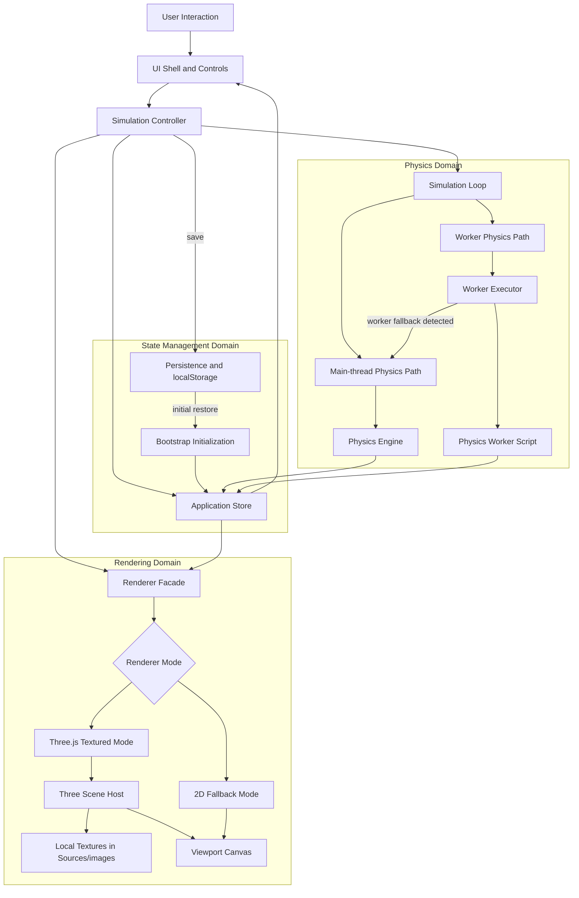

# Shos.NBodyProblemSimulator

[Japanese README](README.ja.md)


[](https://www2.shos.info/shosnbody/)

Browser-only 3D N-body problem simulator built with HTML5, CSS3, Vanilla JavaScript, and Three.js.

## Published sample

- [https://www2.shos.info/shosnbody/](https://www2.shos.info/shosnbody/)
- The published sample is a browser-hosted build of the current simulator and is useful for checking the current UI, rendering mode, and playback flow without local setup.

### Execution image


## Architecture

The runtime keeps physics, rendering, UI updates, and persistence separated so the main-thread path and Worker path can share the same application state flow.



Persistence writes are routed through the controller boundary, while the initial restore path is performed by bootstrap before the first steady-state store flow begins.

## Runtime

- The current default simulation path uses the main-thread runtime with Velocity Verlet as the default integrator.
- The current runtime also supports RK4 comparison, Worker execution paths, and simulation pipeline time validation.
- Use `?execution=main` or `?execution=worker` to override the non-persistent simulation backend for validation runs.
- Three.js is loaded from local vendored files under Sources/vendor.
- Body textures are resolved from Sources/images using normalized Body.name values.
- If Three.js cannot initialize, the app stays usable in 2D fallback mode and the status message explains that texture-backed bodies are unavailable.
- The default startup state uses Count 8 and a bundled body dataset from Sources/data/default-bodies.js derived from Data/nbodies.csv rather than reading the CSV at runtime.
- The Target option `System Center` tracks the center of mass of all bodies and falls back to the average position only when the total mass is zero.
- The current default preset list includes `binary-orbit`, `sample`, and `random-cluster`.
- The `sample` preset applies the bundled fixed dataset from Sources/data/default-bodies.js.
- `random-cluster` now uses a wider generation range: mass `0.05` to `120.00`, radius `6.00`, minimum body distance `0.80`, tangent speed `0.30` to `1.40`, and per-axis velocity jitter up to `0.25`.

## Persistence policy

- localStorage uses the fixed key `nbody-simulator.state`.
- The persistence field policy keeps the persisted fields and non-persisted fields aligned across the implementation, specification, and plans.

Persisted fields:

- `appVersion`
- `bodyCount`
- `bodies`
- `simulationConfig.gravitationalConstant`
- `simulationConfig.timeStep`
- `simulationConfig.softening`
- `simulationConfig.integrator`
- `simulationConfig.maxTrailPoints`
- `simulationConfig.presetId`
- `simulationConfig.seed`
- `uiState.selectedBodyId`
- `uiState.cameraTarget`
- `uiState.showTrails`
- `uiState.expandedBodyPanels`
- `committedInitialState`
- `playbackRestorePolicy`

Non-persisted fields:

- `runtime.lifecycleMetadata`
- `runtime.lifecycleNotice`
- `runtime.statusMessage`
- `runtime.executionNotice`
- `runtime.validationErrors`
- `runtime.fieldErrors`
- `runtime.fieldDrafts`
- `runtime.metrics`
- `runtime.simulationTime`
- trail history point arrays
- intermediate computation state such as worker accumulators and pending requests

- `runtime.lifecycleMetadata` and `runtime.lifecycleNotice` are observability-only runtime values and are reinjected on each startup.
- `playbackState = running` and `playbackState = paused` are not persisted. Reload always normalizes playback to `idle` through `playbackRestorePolicy = restore-as-idle`.

## UI

- The header shows the app title, playback state, and a runtime status message.
- The header stays compact so the viewport keeps most of the vertical space.
- The helper copy in the header is hidden on small and medium layouts and reappears only on wide desktop layouts.
- The controls panel sits directly below the header at every breakpoint, and on large layouts it becomes a compact full-width strip above the body editor and viewport row.
- The controls panel uses compact visible labels such as Count, dt, Soft, Target, and Trail while keeping full accessible names via title or aria-label.
- Real numbers displayed in the UI are rounded to at most two decimal places.
- The Seed field shows `auto on Gen` while blank for `random-cluster`, so the next Generate action is understood to assign an automatic seed.
- The playback buttons use compact visible text such as Gen, Run, Hold, Go, and Reset.
- Validation is hidden when there are no errors and is emphasized only when invalid input exists.
- Body settings provide an Open or Closed toggle for every body card and allow multiple body editors to stay open at the same time.
- The visualization stage is intentionally tall to prioritize the canvas area over non-interactive chrome.
- The visualization height scales in stages across mobile, tablet, desktop, and wide desktop breakpoints.
- The simulation metrics overlay is intentionally compact so it does not dominate the viewport on desktop and wide desktop layouts.

## Local setup

1. Run npm install.
2. Run npm run vendor:three.
3. Serve Sources over HTTP.
4. Open Sources/index.html through the local server.

## Minified bundle build

- Run `npm run build:min` to generate the worker-preserving minified runtime.
- This creates [Dist/index.html](Dist/index.html), [Dist/main.min.js](Dist/main.min.js), [Dist/physics-worker.min.js](Dist/physics-worker.min.js), [Dist/style.css](Dist/style.css), and [Dist/images](Dist/images).
- Use [Dist/index.html](Dist/index.html) when you want the bundled runtime in a distribution-only directory without changing the source entry files.
- Run `npm run build:min:clean` to remove the generated Dist directory and legacy minified files previously emitted under Sources.

### Serving Dist

1. Run `npm run build:min`.
2. Start a static HTTP server with Dist as the document root.
3. Open `http://localhost:<port>/index.html` in the browser.
4. Do not open Dist/index.html with a `file:///` URL because module loading and Worker startup are expected to run over HTTP.

Example using Node:

```bash
npx serve Dist
```

Example using Python:

```bash
python -m http.server 8080 --directory Dist
```

Example using PowerShell:

```powershell
Set-Location Dist; python -m http.server 8080
```

## Testing

- Run npm test for the Node-based regression suite, including the static compact UI checks.
- Run npm run test:ui:install once to install the Chromium browser used by Playwright.
- Run npm run test:ui for real-browser UI acceptance checks against a local static server.
- Run npm run benchmark:phase4 to execute the 60-second benchmark comparison for `?execution=main` and `?execution=worker`.
- Benchmark outputs are saved under Works/benchmarks/phase4/ as timestamped *.raw.json and *.ci.json files plus latest.raw.json and latest.ci.json.

### Benchmark comparison workflow

1. Run `npm run test` to validate the unit and integration suite before benchmarking.
2. Run `npm run test:ui` to confirm the compact UI checks still hold in a real browser.
3. Run `npm run benchmark:phase4` to launch the browser measurement run under the fixed benchmark condition.
4. Use latest.raw.json for full per-scenario measurements and latest.ci.json for stable CI comparison keys.
5. Repeat with `BENCHMARK_DURATION_MS` overridden only when a shorter confirmation run is needed; keep the default 60000ms for acceptance measurement.

### execution=worker comparison steps

1. Open the app with `?execution=main` to capture the current baseline result.
2. Open the app with `?execution=worker` to force the Worker backend for the same preset, body count, and integrator.
3. Use `random-cluster`, `bodyCount = 10`, `Integrator = Verlet`, `Trail = on`, and no camera interaction for the acceptance condition.
4. If the Worker backend fails at runtime, the app automatically switches to the main-thread backend and the status message reports the fallback.
5. Treat the fallback message as a failed Worker benchmark run and investigate before using Worker as the preferred backend.
6. In CI, consume latest.ci.json and evaluate summary.overallStatus, checks.workerFallbackDetected, and the metric comparison objects under comparison.

### Compact UI checks

- Compact visible control text remains shortened as Count, dt, Soft, Target, Trail, Gen, Run, Hold, Go, and Reset.
- Interactive controls keep their full accessible names through aria-label even when the visible text is shortened.
- Validation stays hidden while the form is valid and appears only when invalid input exists.
- Body settings keep a per-body Open or Closed toggle and allow multiple body editors to remain open at the same time.
- At 360px width, the compact controls remain usable without horizontal overflow.
- During running and paused playback states, body editing inputs stay disabled.

## Repository conventions

- Runtime Three.js files are kept in Sources/vendor.
- The current vendored browser bundles are Sources/vendor/three.module.min.js and Sources/vendor/three.core.min.js.
- When updating Three.js, refresh the vendored files together with the npm dependency.

## Updating Three.js vendor files

1. Run npm run three:update.

Manual alternative:

1. Run npm install three@desired-version.
2. Run npm run vendor:three.
3. Optionally run npm run vendor:three:verify.
4. Run npm test.
